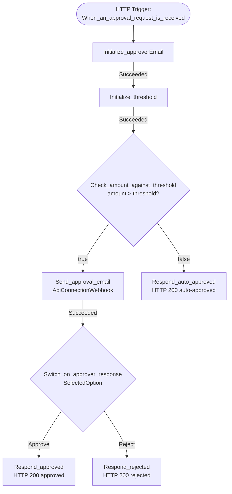

# Approval Workflow

Generated from [`infra/workflows/approval.workflow.json`](../infra/workflows/approval.workflow.json).

## Summary

- **Trigger:** HTTP `Request` (`When_an_approval_request_is_received`) accepting JSON `{ requestId, requester, amount, description }`. `requestId`, `requester`, and `amount` are required.
- **Initialization:** seeds two workflow variables — `approverEmail` (string) and `threshold` (integer).
- **Branching:** `Check_amount_against_threshold` compares `triggerBody().amount` against `@variables('threshold')`.
- **Above threshold:** sends an Office 365 approval email (`Send_approval_email`, `ApiConnectionWebhook`) with `Approve` / `Reject` options and waits on the callback.
- **Switch on response:** `Approve` → HTTP `200 { status: "approved" }`; `Reject` → HTTP `200 { status: "rejected" }`.
- **Below threshold:** short-circuits with HTTP `200 { status: "auto-approved" }`.
- **Outputs:** none (responses are returned synchronously to the caller).
- **Connections:** single managed API connection — `office365` (referenced via `$connections`).

## Flow diagram

## Action table

| Name | Type | Depends on | Notes |
|---|---|---|---|
| `Initialize_approverEmail` | `InitializeVariable` | — (root) | String variable, default `approver@contoso.com`. |
| `Initialize_threshold` | `InitializeVariable` | `Initialize_approverEmail` (Succeeded) | Integer variable, default `1000`. |
| `Check_amount_against_threshold` | `If` | `Initialize_threshold` (Succeeded) | Branches on `triggerBody().amount > variables('threshold')`. |
| `Send_approval_email` | `ApiConnectionWebhook` | (root of `If` true branch) | Office 365 Outlook approval email; blocks until reply. |
| `Switch_on_approver_response` | `Switch` | `Send_approval_email` (Succeeded) | Switches on `body('Send_approval_email').SelectedOption`. |
| `Respond_approved` | `Response` | (root of `Approve` case) | HTTP 200 `{ status: "approved" }`. |
| `Respond_rejected` | `Response` | (root of `Reject` case) | HTTP 200 `{ status: "rejected" }`. |
| `Respond_auto_approved` | `Response` | (root of `If` else branch) | HTTP 200 `{ status: "auto-approved" }`. |

## Review findings

| Severity | Finding | One-line fix |
|---|---|---|
| High | Hard-coded `approverEmail` and `threshold` baked into the definition. | Promote to workflow `parameters` fed from Bicep params (Scenario 02). |
| High | No error handling around `Send_approval_email`; a connector failure surfaces as an opaque 5xx. | Add `retryPolicy` + `HandleFailure` scope with dead-letter POST and 502 response (Scenario 03). |
| Medium | Flat structure makes the workflow hard to read in PRs and the run history. | Group related actions into named `Scope` blocks (Scenario 01). |
| Medium | No notification path on approval beyond the synchronous HTTP response. | Add a Teams adaptive-card post after `Respond_approved` (Scenario 06). |
| Low | Trigger SAS in URL — anyone with the URL can invoke. | Add IP restrictions / front with APIM / rotate SAS keys regularly. |
| Low | No escalation tier for very large amounts. | Add an `escalationApproverEmail` / `escalationThreshold` branch (Scenario 04). |
